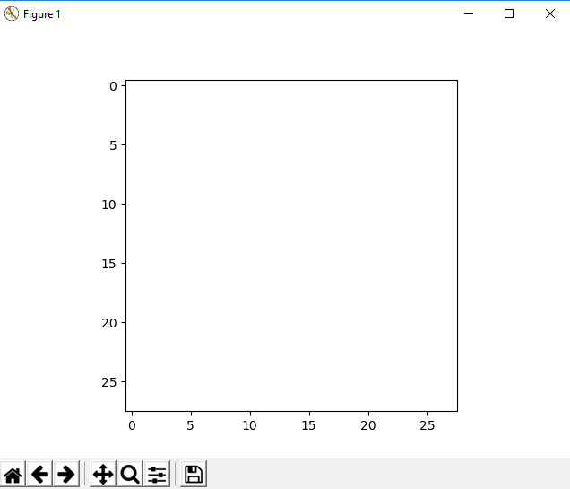

# SignML
A machine learning project based on interpreting letters, then phrases of sign language. This project uses the Kaggle Sign MNIST Database. Truth be told, I wanted to see if I create my own dataset, but creating a high quality dataset for a relatively short project wasn't feasible. I'm actually going to try and document this process instead of haphazardly reviewing my code like last time. So let's hope for the best! (Maybe I'll create my own as an expansion). Please be aware as this is NOT a professional project and is instead my personal project , showcasing my journey in creating this. There will be many bugs in the readme code.

<h1>Day 1</h1>

So here's the picture that Kaggle provides. This (probably) represents the 26 letters the dataset contains. If we open up the training set, we see that the training set is very long, several scrolls long, so we have a lot of data. I'm running this on my local machine, so it may be a bit worrisome for some epoch testing. 

<pre><code>
from keras.models import Sequential
from keras.layers import Dense, Dropout, Flatten, BatchNormalization, Activation
from keras.layers.convolutional import Conv2D, MaxPooling2D
import numpy as np
from pandas import read_csv

trainer = read_csv("C:/Users/Michael Huang/Documents/GitHub/SignML/sign_mnist_train/sign_mnist_train.csv")
#tester = read_csv("C:/Users/Michael Huang/Documents/GitHub/SignML/sign_mnist_test/sign_mnist_test.csv")

print(trainer.head())
</pre></code>

Some familiar imports. The first 3 are some things I'm more than likely going to use. That said, the new one is pandas. Kaggle gave us CSV files, it's only natural that we want to read said CSV files. The head prints out the literal information of the CSV file. Honestly, Pandas Dataframes are just interesting, and also something I'm first experiencing, so let's see how this goes. 
some decent baseline, let's try to finish preprocessing tomorrow.

<h1>Day 2</h1>
Time for preprocessing.
<pre><code>
labels = np.unique(trainer["label"].values)
trainer = trainer.drop(["label"], axis=1) #

images = trainer.values
images = [images[i]/255.0 for i in range(images.shape[0])]
for c, i in enumerate(images, 0):
    image = np.reshape(i, (28, 28))
    image = image.flatten()
    images[c] = np.array(image)
</pre></code>

This took a surprisingly long amount of time. This is the first time I've tried to do a Kaggle dataset with a .csv, so I forgot that I needed to preprocess the data. So, this is what it does. It takes the .csv data, one hots them, then reshapes them into a usable 28x28 format instead of the original 1x784. It then flattens it. Truth be told, this flatten mechanic was advised since I have static data that I always expect to be that size, flattening now instead of doing it between each layer may help. The things I want to keep track here during future coding is as follows
<ul>
    <li> <code>images = [images[i]/255.0 for i in range(images.shape[0])]</code>
    <li> <code>image = image.flatten() </code>
</ul>

I want to know if flattening and one-hoting now makes a difference. That said, I think preprocessing is done? It's time we split up the training set. We want to prevent the following
<ul>
    <li> Overfitting: Fitting too well with the training set, including unwanted pollution and noise into correct cases
    <li> Underfitting: Not fitting the training set at all, this is a failure of the model
</ul>
We can avoid this by use of cross validation. Let's do this by having the training set split into some number, say 80/20, where 80% is normal training and evaluation, whereas the other part of the training set is treated as "tests". I looked up the basic phrase "How to split data into train and test" and got several articles on it and a library called sklearn.
<pre><code>
from sklearn.model_selection import train_test_split
</pre></code>
So here's the function I want to bring with us. Essentially, it splits arrays into random train and test subsets. The examples they provide already have X1, X2, Y1, and Y2 formats. It looks like it only supports this? I wonder if that's a limitation. That said, I discovered a problem. Our label gives us, well the labels, but it does NOT give us the proper format for categorical. My research shows that, once again, Sklearn is a good option to go with, it has, well a lot, let's start with the LabelEncoder The encoder seems to "normalize" labels, or from my persepctive, associate an item to its class, it seems really useful for words, maybe use this later on? 

I stumbled across the OneHotEncoder, this seems to do something similar to the LabelEncoder, it takes two features a minimum it seems? The question of what a "feature" is has come up. I believe that at feature is what differs each data point from each other and makes them distinct. I think our sign-lanuguage only has 1 feature, its identified by its shape, thats it. So maybe this isn't viable. 
<pre><code>
onehot = OneHotEncoder(handle_unknown="ignore")
onehot.fit(labels)
#print(onehot.categories_)
</pre></code>

Here was my attempt at using it. I tried the trainer set and the labels individually but it did not like it one bit, buuuuuut, if we make each item its individual piece (each label is its own array within the array)

<pre><code>
OH = OneHotEncoder(sparse=False)
labels = labels.reshape(len(labels), 1)
print(labels)
test = OH.fit_transform(labels)
print(test)
</pre></code>

How this is some progress, sort of. It gives us the [0 ... 1 .. 0] binary we expect, but also adds a dot after each number, this doesn't appear to be a problem since if I directly set something without the dot, its still appears. So, this means we actually have what we want!

<pre><code>
dataset = tester.values
print(dataset)
CT = ColumnTransformer([('encoder', OneHotEncoder(), [0])], remainder="passthrough")
dataset = np.array(CT.fit_transform(dataset), dtype = int)
print(dataset)
</pre></code>
Here's using the ColumnTransformer, apparently, this is an improved version of the oneHot/Label Encoder. It's cool and it printed what I expected, but its not what I need for SKLEARN, it only wants the labels. 

<pre><code>
labels = (trainer["label"].values)
</pre></code>

Ooooh boy I am an idiot. I had unique values instead of all labels. This, obviously makes no sense, the labels array should hold the labels of all the data in the array, obviously, it neesd to keep the original structure, it wouldn't work otherwise huh? Man how did I miss that? Well that fixed an annoying SKLEARN bug. Maybe preprocesssing isn't as done as I thought. 

<pre><code>
x_train = x_train.astype('float32')
x_train = x_train/255.0
x_train = np.reshape(x_train, (x_train.shape[0], 28, 28, 1))

x_test = x_test.astype('float32')
x_test = x_test/255.0
x_test = np.reshape(x_test, (x_test.shape[0], 28, 28, 1))
</pre></code>

Okay, now we are back on some familiar territory. Here, I want to do the /255.0 stuff am I familiar with, I decided to comment out the original /255.0 I did for now. I decided to treat them as floats just to be safe. I'm going to assume that we're working with channels_last, so the Conv2d parameters should be <code>(batch, rows, columns, color channels)</code>. I've also decided to make it greyscale, after all we really don't care about the color of the sign itself. Otherwise, we're ready!

<pre><code>
def defineModel():
    model = Sequential()

    model.add(Conv2D(16, (3, 3), input_shape=(x_test.shape[1:]), activation='relu', padding='same'))
    model.add(Dropout(0.1))
    model.add(MaxPooling2D(pool_size=(2, 2)))
    model.add(BatchNormalization())

    model.add(Conv2D(64, (3, 3), activation='relu',padding='same'))
    model.add(Dropout(0.1))
    model.add(MaxPooling2D(pool_size=(2, 2)))
    model.add(BatchNormalization())

    model.add(Conv2D(128, (3, 3), activation='relu',padding='same'))
    model.add(Dropout(0.2))
    model.add(MaxPooling2D(pool_size=(2, 2)))
    model.add(BatchNormalization())

    model.add(Flatten())
    model.add(Dense(128, activation='relu'))
    model.add(Dropout(0.2))

    model.add(Dense(y_train.shape[1], activation='softmax'))

    model.compile(optimizer='adam', loss="categorical_crossentropy", metrics=["accuracy"])
    return model
</pre></code>

Here's our simple model. It has 3 Conv layers and 2 Dense layers. Many of these choices I made are due to them being "standard" (relu, adam etc). I spent a good few hours on trying to figure out why my stuff was bugged, turns out it was because of Flatten. The last part is important since my last project went over binary instead of categorical. We do softmax, well, to get our originally non-normal information and get the highest probability of what we are looking for. In other words, we take our prediction and output our best guess.

<pre><code>
model.fit(x_train, y_train, validation_data=(x_test, y_test), epochs=25, batch_size=120)

score = model.evaluate(x_test, y_test, verbose=1)

print(score)
</pre></code>

This simply trains the model. We should save the model, then test on random images found on the internet. 

<h1>Day (totally 3)</h1>
Well well well! Turns out I wasn't doing this right. I ran some predictions, and well, it was DEFINITELY not right, I mean I legitimately took 20 images and got the same value each time. So this means that the evaluation and accuracy must be very, very wrong. I believe this is due to overfitting. 

Our model returns 3 different classes, each correlating to a different prediction. You would think this would, probably, give us whatever correlates to C. It does NOT, like, REALLY DOES NOT. So why is this? Could it be overfitting? That's always a problem, but it turns out it's right here. 
<pre><code>
img = load_img("C:/Users/Michael Huang/Documents/GitHub/SignML/Ctrue.png", target_size=(28, 28))
img = img_to_array(img)
#img = np.reshape(img, (28, 28, 1))
#img = img/255.0
plt.imshow(img)
plt.show()
</pre></code>

Feel free to run that plt.show() code, our magical sign turns into this

Literally a blank screen, I mean LITERALLY a blank screen, how the heck should I expect my model to solve that? Tomorrow's woes, tomorrow's woes.

Sources:
https://towardsdatascience.com/train-test-split-and-cross-validation-in-python-80b61beca4b6
https://scikit-learn.org/stable/modules/generated/sklearn.preprocessing.LabelEncoder.html
https://towardsdatascience.com/columntransformer-in-scikit-for-labelencoding-and-onehotencoding-in-machine-learning-c6255952731b?
https://stackoverflow.com/questions/50473381/scikit-learns-labelbinarizer-vs-onehotencoder